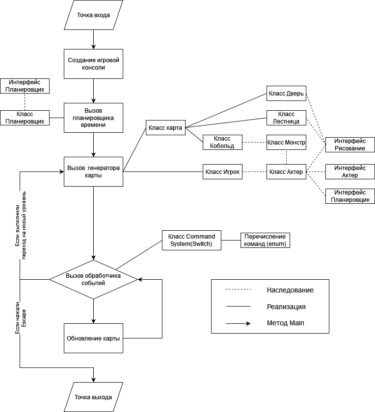

# RogueLike. Король подземелий.

Особую благодарность выражаю _Farony Bracy_ за предоставленное руководство.

    RogueLike - консольная игра, позволяющая окунуться в мир экшена и фентези. Здесь вам предстоит осваивать подземелья, сражаясь с невиданными миром монстрами и чудищами. 

Проект реализован на языке С# с помощью библиотек RLNet и RogueSharp на платформе NET.Fraemwork.

Ниже представлена архитектура проекта:

__Недостатки версии 1.0 :__

    - игрок может перемещаться по лестнице только вниз;
    - после гибели игрока - игра продолжается;
    - не реализовано окно инвентаря;
    - не прорисовываются двери в стенах.

__Идеи для дальнейшей реализации проекта :__

    + устранить существующие недостатки;
    + созданные карты вынести в отдельный список;
    + создать возможность сохранения текущих результатов;
    + реализовать входную панель для доступа к сохранениям;
    + добавить снаряжение на карту и возможность взаимодействия с ним;
    + добавить сундуки на карту для хранения снаряжения;
    + добавить на карту торговцев снаряжением;
    + добавить на карту новых монстров;
    + реализовать сложность монстров с ростом уровней;
    + рассмотреть возможность добавления новых иконок персонажа и монстров.

